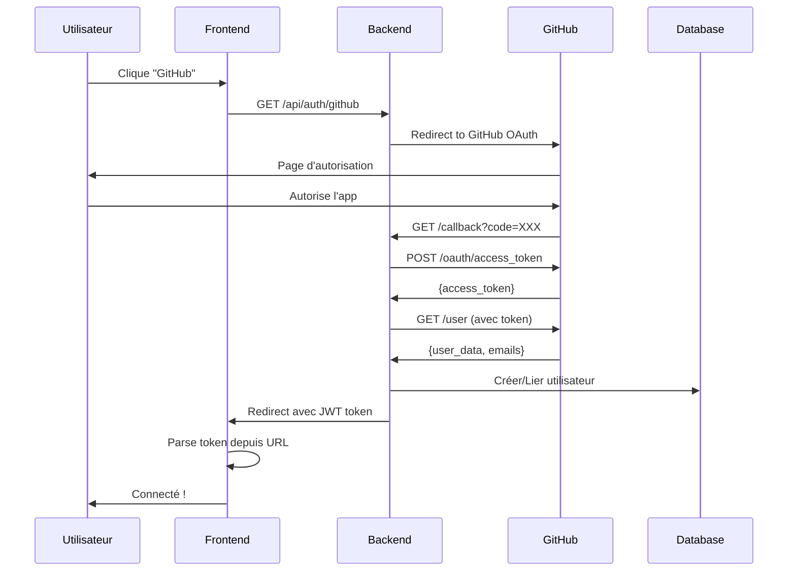

# ✅ Authentification GitHub ajoutée à ft_transcendence

## 🎉 Fonctionnalités ajoutées

L'authentification GitHub a été entièrement intégrée au projet ft_transcendence !

### 🔧 Modifications Backend

- ✅ **Base de données** : Colonne `github_id` ajoutée à la table `users`
- ✅ **UserRepository** : Méthodes `findByGitHubId()` et `updateGitHubId()` ajoutées
- ✅ **Routes OAuth** : 
  - `GET /api/auth/github` - Redirection vers GitHub
  - `GET /api/auth/github/callback` - Traitement du callback
- ✅ **Types TypeScript** : Interfaces mises à jour pour GitHub
- ✅ **Sécurité** : Logs de connexion GitHub et gestion d'erreurs

### 🎨 Modifications Frontend

- ✅ **Boutons GitHub** : Ajoutés aux formulaires de connexion et inscription
- ✅ **Service API** : Méthodes pour GitHub OAuth
- ✅ **AuthContext** : Gestion du callback GitHub automatique
- ✅ **Design** : Boutons avec animations et effets visuels

### 🔄 Scripts et Migration

- ✅ **Script de migration** : `migrate-github.ts` pour ajouter la colonne
- ✅ **Makefile** : Commande `make db-migrate-github`
- ✅ **Package.json** : Script `npm run db:migrate:github`

## 🚀 Comment configurer GitHub OAuth

### 1. Créer une GitHub App

1. Va sur [GitHub Developer Settings](https://github.com/settings/developers)
2. Clique sur **"New OAuth App"**
3. Configure :
   - **Application name** : `ft_transcendence_auth`
   - **Homepage URL** : `http://localhost:3000`
   - **Authorization callback URL** : `http://localhost:8000/api/auth/github/callback`

### 2. Ajouter les credentials

Dans ton fichier `.env` :
```bash
# GitHub OAuth
GITHUB_CLIENT_ID=ton_client_id_github
GITHUB_CLIENT_SECRET=ton_client_secret_github
GITHUB_REDIRECT_URI=http://localhost:8000/api/auth/github/callback
```

### 3. Migrer la base de données

```bash
# Dans le dossier ft_transcendence
make db-migrate-github
```

### 4. Démarrer le projet

```bash
make dev
```

## 🎮 Comment tester

1. **Lance le projet** : `make dev`
2. **Va sur** : `http://localhost:3000`
3. **Clique sur le bouton GitHub** dans le formulaire de connexion
4. **Autorise l'app** sur GitHub
5. **Tu es connecté** automatiquement ! 🎉

## 🔍 Flux d'authentification GitHub



## 📂 Fichiers modifiés

### Backend
```
├── .env (variables GitHub ajoutées)
├── backend/src/
│   ├── database/schema.sql (colonne github_id)
│   ├── types/database.ts (interface User)
│   ├── repositories/UserRepository.ts (méthodes GitHub)
│   ├── routes/auth.ts (routes OAuth)
│   └── scripts/migrate-github.ts (migration)
```

### Frontend  
```
├── frontend/src/
│   ├── services/api.ts (GitHub OAuth)
│   ├── contexts/AuthContext.tsx (callback handling)
│   └── components/Auth/
│       ├── LoginForm.tsx (bouton GitHub)
│       └── RegisterForm.tsx (bouton GitHub)
```

## 🛠️ Commandes utiles

```bash
# Voir les stats de la DB
make db-stats

# Logs du backend
make logs-backend

# Shell dans le container backend
make shell-backend

# Redémarrer le projet
make stop && make dev
```

## 🔒 Sécurité

- ✅ **Tokens sécurisés** : JWT avec expiration
- ✅ **Validation GitHub** : Vérification de l'email et des données
- ✅ **Logs de sécurité** : Toutes les actions sont loggées
- ✅ **Gestion d'erreurs** : Redirections propres en cas d'échec
- ✅ **Protection CSRF** : State parameter dans OAuth

## 🎯 Prochaines étapes

- [ ] Ajouter Discord OAuth
- [ ] Ajouter la 2FA
- [ ] Implémenter le linking de comptes multiples
- [ ] Ajouter Google OAuth (déjà préparé)

---

**🎮 Have fun coding and playing Pong! 🏓**
